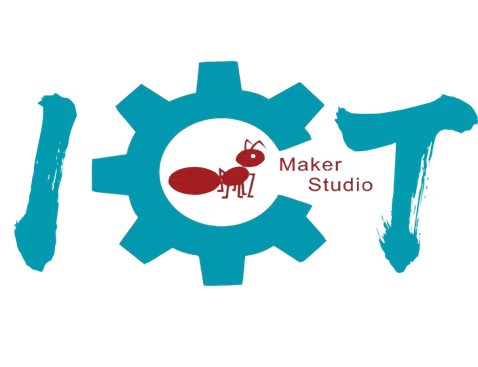

  <b>心中有火，眼中有光，系万物于 鸿蒙，联数据辅众生——Maker-IoT，改变世界的开发者 
  本开源仓库是一款基于ESP32的智能手部数据采集手套，结合弯曲传感器和MPU6050惯性单元，实现对手部动作的精确捕捉与分析。</b>  
  
  
  
  
   
  <a href="docs/README_TW.md">中文(简体)</a> |  
  <a href="docs/README_EN.md">English</a> | 
  <a href="docs/README_TW.md">中文(繁體)</a> 

------------------------------

## 目录

[1、Arduino IDE开发环境搭建](./doc/arduino_env.md)

##  硬件
1. 开发板：ESP32
2. 传感器：弯曲传感器、MPU6050
3. 电源：锂电池

接线：
| ESP32 | 弯曲传感器 | MPU6050 |
| :---: | :--------: | :-----: |
|  GND  |    GND     |   GND   |
| 3.3v  |    VCC     |   VCC   |
|  21   |            |   SDA   |
|  22   |            |   SCL   |
|  32   | Flex1_ADC  |         |
|  33   | Flex2_ADC  |         |
|  34   | Flex3_ADC  |         |
|  35   | Flex4_ADC  |         |
|  36   | Flex5_ADC  |         |

