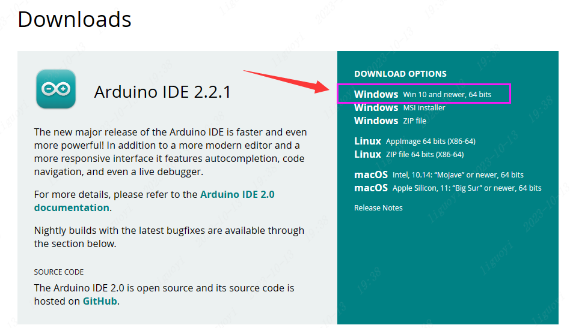
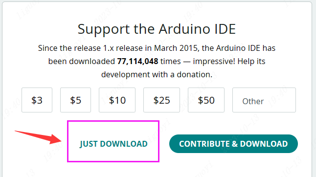

# 1. Arduino环境安装
Arduino是一种开源硬件和软件平台，用于构建和控制各种物理设备和交互式项目。它由一个基于开放源代码的软件开发环境构成。Arduino编程语言是一种基于C/C++简单易懂的语言。Arduino的简易性、灵活性、还有易获得的资源以及丰富的应用领域，使得它成为一个受欢迎和广泛使用的开发平台。无论是初学者还是专业开发者，都可以从中获得快速开发和创新的能力。
## 1.1 安装Arduino IDE
1. 打开Arduino IDE官网的软件下载页面，选择对应的系统和系统位数下载。这里我选择最新的Windows 10 64位环境。

    

2. 在弹出的新界面，可以选择直接下载，也可以选择捐赠并下载。

    

3. 运行安装程序，一直下一步即可。（建议在设置安装路径时不要保存在C盘）

## 1.2 安装esp32包
在Arduino 中安装ESP32 芯片支持包，有在线安装和离线安装两种方式。两者的主要区别在于是否需要联网和安装过程。

1. 在线安装：此种方式需要保证你的电脑可以连接到互联网，并且在Arduino的首选项（Preference）中添加ESP32的开发板管理器URL，然后在开发板管理器（Board Manager）里搜索ESP32并安装。这是最简单的方式，它会自动下载安装必要的文件和工具，并且可以自动更新到最新的支持包版本。但是这也需要一定的网络带宽，并且在国内下载较慢。

2. 离线安装：此种方式是先从GitHub等地方下载好ESP32芯片的支持包，然后在本地解压并放到Arduino的安装目录下的hardware子目录中。离线安装好处在于，你可以在没有网络的环境下安装，或者预先下载好以备在网络较慢的环境中使用。缺点则是需要手动完成下载和放置，比较麻烦些，同时在更新支持包版本时需要重复这个过程。

## 1.2.1 在线安装
1. 打开Arduino IDE，选择File -> Preferences。

    

2. 添加ESP32的板管理链接，更新 Additional boards manager URLs。
将以下这句链接粘贴到 URLs 框内。
    ```
    https://raw.githubusercontent.com/espressif/arduino-esp32/gh-pages/package_esp32_dev_index.json
    ```
    
点击 OK 保存。

3. 打开板管理器并搜索输入ESP32，找到 esp32 by Espressif Systems。点击 INSTALL 进行安装。

    

    等待下载成功。

   

    如果一直下载失败，或者下载太慢，建议使用离线安装方式。

4. 安装完成关闭全部arduino窗口，确保arduino已经关闭。

5. 重新打开arduino，并打开 开发板管理器,看到esp32已经安装完成。

   

## 1.2.2 离线安装

1. 下载esp32离线安装工具。

      链接：https://pan.baidu.com/s/1zocFRBlMveMA00QhmzkKKA?pwd=1234<br>
      提取码：1234

2. 选择安装路径。注意，要放在对应用户的arduino器件包目录。以下为Arduino IDEV2.2.1版本的安装路径：
    ```
    C:\Users\{用户名}\AppData\Local\Arduino15\packages\
    ```
    注意，AppData 是隐藏文件夹，如果要找到它，需要给文件夹查看选项中的隐藏的项目打勾。
   

    以用户名为 win 为例: `C:\Users\win\AppData\Local\Arduino15\packages`

3. 安装完成关闭全部arduino窗口，确保arduino已经关闭。

4. 重新打开arduino，并打开 开发板管理器，看到esp32-arduino已经安装完成。
   

## 1.3 修改中文显示

1. 打开arduino IDE的首选项。【File】->【 Preferences】。
   
2. 在首选项界面，语言中选择中文（简体）。
   

3. 如果IDE没有更新，则关闭IDE重新打开即可。

## 1.4 运行例程测试


选择我们的板子为 ESP32S3 Dev Moudule；
   
选择例程，这里我们选择获取芯片ID的例程；
   
选择我们的端口号，这里我们选择CH340K的的COM36；
每个电脑的端口都不一定是一样的，可以通过插拔开发板，确定哪个端口是ESP32S3开发板的端口。
   
如果无法识别请安装CH340驱动。
暂时无法在飞书文档外展示此内容
点击下载按键，此时会自动编译并下载；
   
